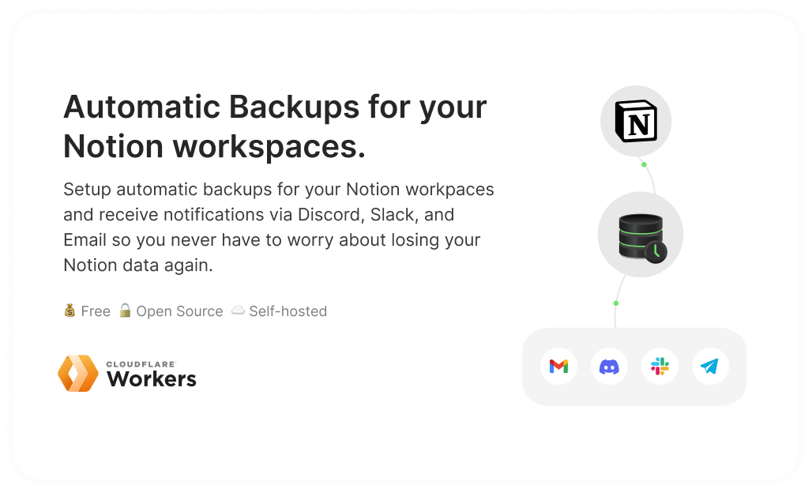

# Notion Backups

Set up automated backups for your Notion workspaces that run on a time-basis and notify you by Slack, Discord, or email, so you never worry about losing your Notion data again.



## Pre-requisites

- A Free [Cloudflare workers](https://dash.cloudflare.com/sign-up) account
- Notion token `token_v2` (See this [guide](https://www.notion.so/Find-Your-Notion-Token-5da17a8df27a4fb290e9e3b5d9ba89c4))

## Getting started

1. Log in to your Cloudflare workers dashboard, select the workers tab, and then create a new service.
   

2. Give your script a name and then click the 'create service' button.
   

3. Click on the `Quick edit` button and Copy-paste the [Script code](https://raw.githubusercontent.com/notionblog/notion-backups/master/dist/worker.js?) into the editor.
   

4. Follow this [guide](https://www.notion.so/Find-Your-Notion-Token-5da17a8df27a4fb290e9e3b5d9ba89c4) to find your Notion token v2.

5. Navigate to your **Worker > Settings > Variables** and add the following secrets:

   - `TOKEN_V2` paste the value of your Notion token (**required)**
   - `SLACK_WEBHOOK` paste your [Slack webhook](https://api.slack.com/messaging/webhooks#posting_with_webhooks) URL (optional to receive notification via Slack)
   - `DISCORD_WEBHOOK` paste your [Discord webhook](https://support.discord.com/hc/en-us/articles/228383668-Intro-to-Webhooks) URL (optional to receive notification via Discord)
     

6. Returning to your worker editor page, you should now see the following page.
   
7. To manually test the script, add a new variable with the name `MODE` and the value `test` to your environment variables.
   
8. If you click the trigger export button again, you should receive a success message, and it will begin exporting your workspace. If you configured your Discord or Slack webhook url, you should receive a message in a few minutes, and you will also receive an email from Notion.
   
9. in order for the script to execute on a time-based, you must create a cron job task for it,

   Navigate to **Worker > Triggers > Cron Triggers** and create a new cron trigger

   Examples:

   `0 0 * * *` will cause the script to execute once everyday.

   `0 0 */10 * *` will cause the script to execute once every ten days

   `0 0 1 * *` will cause the script to run on a monthly basis.
   

## Change export type to `Markdown`

To change the backup's export format from html to markdown or PDF (enterprise plan), create a new environment variable called EXPORT TYPE and set its value to `html` or `markdown`.

## Guides

- [Find your Notion Token](https://www.notion.so/Find-Your-Notion-Token-5da17a8df27a4fb290e9e3b5d9ba89c4)
- [Set up a Slack webhook](https://api.slack.com/messaging/webhooks#posting_with_webhooks)
- [Set up a Discord webhook](https://support.discord.com/hc/en-us/articles/228383668-Intro-to-Webhooks)

## Running project locally

**Requirements**

- Linux or WSL
- Node

### Steps to get server up and running

**Install wrangler**

```
npm i -g wrangler
```

**Login With Wrangler to Cloudflare**

```
wrangler login
```

**Install packages**

```
npm install
```

**Run**

```
wrangler dev
```

# Support Me

<a href='https://ko-fi.com/M4M37F1UV' target='_blank'></a>
